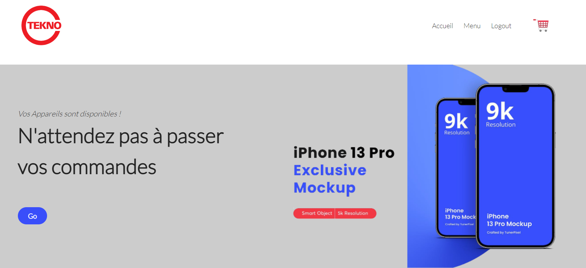
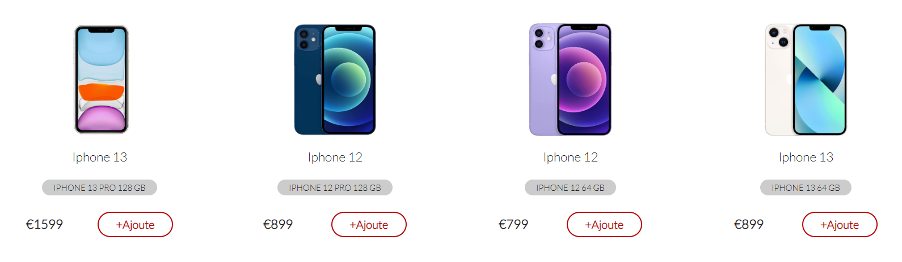
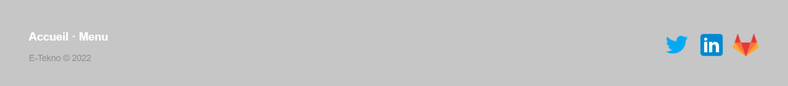

# E-Tekno  :iphone: :computer:

## A Propos
C'est une Application Web permettant de passer les commandes des produits technologiques. Ces produits sont des ordinateurs, des tablettes et des téléphones. Avant d'acheter un produit, le client doit créer un compte en s'inscrivant dans la rubrique "S'inscrire" en suite passer à l'achat dans sur son compte et il peut vérifier l'état des produits. Les commandes des clients sont vérifées dans le compte Admin. Il peut mettre à jour le statut de sa commande( Validation, Préparation, Livraison...).

## Exigences

* NodeJS v16.14.0
* MongoDB v5.0.6

 		
	
## Dépendances externes

Voici les API/services externes utilisés pour cette application :
* Tailwindcss CSS est essentiellement un framework CSS utilitaire pour créer rapidement des interfaces utilisateur personnalisées ` ( https://tailwindcss.com/ ) `
* Stripe - pour les payment -de nos commande.  Stripe est un traitement des paiements en ligne pour les entreprises sur Internet  `( https://stripe.com )`
* Laravel-mix for compiling and optimizing assets 

## Installation 
Après download ou clone, exécutez `npm install` OU `yarn install` pour installer toutes les dépendances.

## Run

npm start

npm run watch -> pour lancer notre css, scss et js

## Information

Nous avons partagé notre base de données dans le dossier "database". Vous pouvez importer sur MongoDB. 

Si vous voulez contrôler le compte d'admin : `admin@admin.com`  `password: 123456` 

Si vous voulez créer un compte admin vous devrez créer un compte user , après vous devrez changer le nom `role` en tant que `admin`.

# Interface
### Header

### Body

### Footer

________________________________________________________________________ The END _____________________________________________________________________
